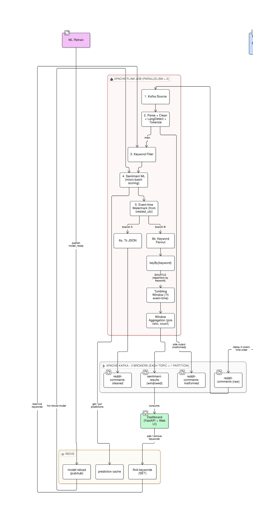

# Reddit Sentiment Pipeline - Big Data Project

This project is currently deployed at http://18.199.221.182:8000/
A real-time big-data pipeline that replays a historical Reddit comment dump
through Kafka, cleans and tokenizes it with Apache Flink, scores sentiment
with a self-trained ML model, and visualizes per-keyword sentiment trends
live in a web dashboard.

Built as a TUHH **Big Data** course project (SoSe Semester 2026), under
lecturers **Prof. Dr.-Ing. Stefan Schulte** (lecture) and **Nisal Hemadasa**
(lab), together as the group W3/A.
The group members for this project viz. Aaradhya Deotale, Sahil Salunkhe, Muhammad Rehan, Fida Ali Baig, Diya Sonavale and Saira Batool  split the work into six phases (P1–P6),
each owned by its own folder in this repo:

| Phase and Author | Component               | Folder             | Role |
|-------|--------------------------|---------------------|------|
| P1 - Fida  | Data replay / producer   | [`kafka-producer/`](kafka-producer/) | Reads the Reddit dump and replays it into Kafka in timestamp order |
| P2 - Saira   | Message broker           | `kafka-producer/docker/` | 3-broker Kafka cluster (KRaft, no Zookeeper) |
| P3 - Diya  | Stream processing        | [`flink-streaming/`](flink-streaming/) | Cleans, tokenizes, tags keywords, scores sentiment, aggregates windows |
| P4 - Sahil   | ML model                 | [`ml-model/`](ml-model/) | Trains and versions the sentiment classifier used by Flink |
| P5 - Aaradhya    | Dashboard (serving/UI)   | [`dashboard/`](dashboard/) | REST + WebSocket API and React SPA showing live sentiment |
| P6 - Rehan  | Ops / deployment         | `dashboard/` (control panel), [`deploy/aws/`](deploy/aws/) | Docker packaging, a UI control panel to drive the whole pipeline, and Terraform for a live AWS deployment |

Each folder has its own detailed README; this document explains how the
pieces fit together and how to stand the whole pipeline up end to end.

---

## Table of Contents

- [Architecture](#architecture)
- [Repository layout](#repository-layout)
- [Dataset](#dataset)
- [Requirements](#requirements)
- [Quick start - full pipeline with Docker](#quick-start---full-pipeline-with-docker)
- [Local development (without Docker)](#local-development-without-docker)
- [Cloud deployment (AWS)](#cloud-deployment-aws)
- [Configuration](#configuration)
- [Testing](#testing)
- [Troubleshooting](#troubleshooting)
- [Screenshots](#screenshots)
- [License](#license)

---

## Architecture



**Data flow, in words:**

1. **kafka-producer** streams historical comments from a `.zst`-compressed
   Reddit dump into the `reddit-comments` Kafka topic, in strict
   `created_utc` order, at a configurable replay speed.
2. **Kafka** (3 brokers, KRaft mode) is the backbone connecting every other
   component. Topics: `reddit-comments` → `reddit-comments-cleaned` /
   `reddit-comments-malformed` → `sentiment-results` / `analytics-results`.
3. **flink-streaming** consumes raw comments, strips URLs/markdown,
   tokenizes (emoji-safe), detects language, tags each comment with any
   matched keywords, scores sentiment using the trained model from
   **ml-model**, and aggregates results into per-keyword tumbling
   event-time windows. A side pipeline of **probabilistic sketches**
   (Count-Min for trending words/phrases per tracked keyword, HyperLogLog
   for distinct authors per keyword) summarizes the stream in fixed memory
   into `analytics-results`.
4. **ml-model** is trained offline (VADER lexicon labels a corpus, then a
   real classifier - TF-IDF/Word2Vec features + scikit-learn - is trained
   on those labels). The versioned model store is mounted into the Flink
   containers; the scorer hot-reloads new versions without a restart. A
   `retrainer` service can also run continuously alongside the pipeline,
   consuming `reddit-comments-cleaned`, labeling with VADER, and retraining
   automatically every `RETRAIN_EVERY_N` comments - see
   [ml-model/src/ml_model/retrain/](ml-model/src/ml_model/retrain/).
5. **dashboard** consumes `sentiment-results` (aggregated windows),
   `reddit-comments-cleaned` (individual comments) and `analytics-results`
   (sketch summaries) and serves both a REST/WebSocket API and a React SPA
   with live charts, a comment feed, a Trends tab (trending terms with
   momentum + author reach), and Kafka/Flink health monitoring tabs.
6. **Redis** backs three things shared between Flink and the dashboard: the
   live tracked-keyword set (`flink:keywords`, so keywords can be
   added/removed at runtime without restarting the pipeline), a prediction
   cache for the sentiment scorer, and a `model-reload` pub/sub channel the
   retrainer publishes to (`model_ready`) so the running scorer hot-reloads
   without a restart.

All Docker services join a single external network, **`bd_streaming`**,
so containers can address each other by service name (`kafka-1`,
`jobmanager`, `redis`, …) regardless of which folder's compose file started
them.

---

## Repository layout

```
.
├── kafka-producer/     # P1 - dataset replay into Kafka + local Kafka cluster (docker/)
├── flink-streaming/    # P3 - PyFlink job: parse, preprocess, keyword-tag, score, window
├── ml-model/           # P4 - training pipeline + versioned model store + continuous retrainer
├── dashboard/          # P5/P6 - FastAPI + React serving layer and control panel
├── deploy/aws/         # P6 - Terraform (MSK/Redis/EC2) + scripts to run the pipeline on AWS
├── RC_2019-04.zst      # Reddit comment dump (not committed - see Dataset below)
└── README.md           # this file
```

Each subfolder README documents its internals in depth:

- [`kafka-producer/README.md`](kafka-producer/README.md)
- [`flink-streaming/README.md`](flink-streaming/README.md)
- [`ml-model/README.md`](ml-model/README.md)
- [`dashboard/README.md`](dashboard/README.md)

---

## Dataset

This project uses the **Pushshift Reddit comments dataset for April 2019**
(`RC_2019-04.zst`), available from Zenodo:

**https://zenodo.org/records/3608135**

- The dump is Pushshift-style, one JSON object per line, compressed with
  Zstandard (`.zst`).
- It is **not committed to this repository** - the file is large (tens of
  GB) and is git-ignored. Download it from the link above and place it at
  the **repo root** before running the producer, or point `--file` /
  `ZST_FILE` at wherever you've stored it.
- To keep the working set manageable, the pipeline filters to comments
  with `created_utc` in the range **1554076800 - 1555472130**
  (2019-04-01 → 2019-04-17).
- Only the following fields are used from each JSON record:
  - `id` - unique comment identifier
  - `author` - username of the commenter
  - `created_utc` - Unix timestamp of the comment
  - `body` - the comment text (source for sentiment scoring)
  - `score` - net upvotes minus downvotes
  - `subreddit` - the subreddit the comment was posted in
  - `controversiality` - binary flag (0/1) for near-evenly-split vote comments
- Emoji and other Unicode content in `body` are preserved through
  preprocessing rather than stripped, since they can carry sentiment signal.
- A small synthetic sample (`kafka-producer/data/make_test_data.py`) is
  provided for smoke-testing the pipeline without downloading the full dump.

---

## Requirements

- **Docker Desktop** (with enough memory allocated - Kafka + Flink + Redis +
  dashboard together are comfortably run with 4+ GB free)
- **Python 3.11** (all Python components target 3.11)
- **Node.js 18+** and npm (only needed for local dashboard frontend dev -
  Docker builds the SPA itself)
- The dataset file **`RC_2019-04.zst`** - see [Dataset](#dataset) above for
  where to get it and where to place it.
- Free host ports: `9092`, `9095`, `9096` (Kafka), `8081` (Flink UI),
  `6379` (Redis), `8000` (dashboard API), `5173` (Vite dev server, optional)

---

## Quick start - full pipeline with Docker

All compose files fall back to sane defaults baked into the compose YAML
(`${VAR:-default}`), so **no `.env` files are required** to get the pipeline
running - copy the `.env.example` files later, only if you want to change a
setting. Services must be started **in order** because each later compose
file joins the `bd_streaming` network created by an earlier one.

### TL;DR - copy/paste to see it working

This brings up Kafka + Flink + the dashboard and replays a tiny built-in
sample dataset, with no dataset download, no `.env` editing, and no ML
model required (the Flink job runs fine without one - comments flow and the
comment feed populates; sentiment scores just show `no_model_available`
until you train a model in the [optional step](#optional-train-a-real-sentiment-model) below):

```bash
git clone <this-repo-url> && cd bd_project_w3_a

cd kafka-producer  && docker compose -f docker/docker-compose.yml up -d
cd ../flink-streaming && docker compose -f docker/docker-compose.yml up -d --build
cd ../dashboard     && docker compose -f docker/docker-compose.yml up -d --build

cd ../kafka-producer
python -m venv .venv && source .venv/bin/activate   # Windows: .venv\Scripts\activate
pip install -r requirements.txt
python data/make_test_data.py
python src/producer/producer.py --file data/test_data.zst \
  --broker localhost:9092,localhost:9095,localhost:9096 --speed 100
```

Open **http://localhost:8000** and watch the comment feed / Pipeline tab
update. The steps below are the same thing broken out individually, with
health checks and the optional pieces (real dataset, trained model) filled
in.

### 1. Start Kafka (creates the shared network)

```bash
cd kafka-producer
docker compose -f docker/docker-compose.yml up -d
```

Confirm the cluster is healthy:

```bash
docker exec kafka-1 /opt/kafka/bin/kafka-topics.sh --bootstrap-server localhost:9092 --list
```

### 2. Start Flink (joins the Kafka network)

```bash
cd flink-streaming
docker compose -f docker/docker-compose.yml up -d --build
```

Check the job submitted:

```bash
docker logs flink-reddit-job
```

Look for `Job has been submitted with JobID ...`, or open the Flink Web UI
at **http://localhost:8081** → Running Jobs. No trained model is needed yet -
the scorer just reports `sentiment_status: no_model_available` until one
shows up under `ml-model/models/` (see the optional step below).

### 3. Start the dashboard

```bash
cd dashboard
docker compose -f docker/docker-compose.yml up --build
```

Open **http://localhost:8000**. The dashboard's **Pipeline** tab shows an
operational flow diagram in four stages (ingestion → Flink → Kafka outputs →
dashboard) with color-coded health on each hop, and its **control panel** can
start/stop the producer and reset the pipeline directly from the UI (local
development only - gated behind `CONTROL_ENABLED`).

### 4. Replay data into the pipeline

Either use the dashboard's control panel, or run the producer manually:

```bash
cd kafka-producer
python -m venv .venv && source .venv/bin/activate   # Windows: .venv\Scripts\activate
pip install -r requirements.txt
python data/make_test_data.py                                    # small smoke-test dataset
python src/producer/producer.py \
  --file data/test_data.zst \
  --broker localhost:9092,localhost:9095,localhost:9096 \
  --speed 100
```

For the full historical dataset, download `RC_2019-04.zst` (see
[Dataset](#dataset)), point `--file` at it (or set `ZST_FILE` in a
`kafka-producer/.env`), and pick a `--speed` multiplier appropriate for how
fast you want the 2019-04-01 → 2019-04-17 window replayed.

Watch sentiment appear live in the dashboard's **Sentiment** tab (per-window
aggregates need a full window to close - lower `WINDOW_SIZE_SEC` for faster
feedback during testing).

### 5. (Optional) Train a real sentiment model

Skip this to just watch comments and metadata flow through the pipeline.
Train a model when you want real sentiment scores instead of
`no_model_available`. Training needs a small corpus of *cleaned* comments,
which only exists once the pipeline has processed some data (step 4), so
pull a slice off the `reddit-comments-cleaned` topic first:

```bash
docker exec kafka-1 /opt/kafka/bin/kafka-console-consumer.sh \
  --bootstrap-server localhost:9092 --topic reddit-comments-cleaned \
  --from-beginning --max-messages 2000 --timeout-ms 15000 \
  > ml-model/data/cleaned_comments.jsonl

cd ml-model
python -m venv .venv && source .venv/bin/activate   # Windows: .venv\Scripts\activate
pip install -r requirements.txt

# 1. Label the corpus with VADER (labels only)
python src/ml_model/labeling/label_corpus.py --input data/cleaned_comments.jsonl --output data/labeled_comments.jsonl

# 2. Train the real classifier
python src/ml_model/model/train.py --input data/labeled_comments.jsonl --feature tfidf
```

This writes a new version under `ml-model/models/`. Flink mounts this
directory directly, so the already-running scorer hot-reloads it
automatically - no restart needed. For the full Reddit dump, replay more
data before training so the corpus is representative.

### Teardown

```bash
cd dashboard        && docker compose -f docker/docker-compose.yml down
cd ../flink-streaming && docker compose -f docker/docker-compose.yml down
cd ../kafka-producer  && docker compose -f docker/docker-compose.yml down
```

> Do **not** add `--remove-orphans` here - the compose files share the
> `bd_streaming` project/network, and `--remove-orphans` will tear down
> containers from the *other* compose files too.

---

## Local development (without Docker)

Each component can run natively against Docker-hosted Kafka/Flink/Redis -
useful for fast iteration on one piece at a time. See each subfolder's
README for details:

- **kafka-producer** - `pytest tests/ -v`, then run `producer.py` directly
  against `localhost:9092,localhost:9095,localhost:9096`.
- **flink-streaming** - `pytest tests/ -v` needs no Docker; running the job
  itself (`python src/flink_job/main.py`) needs a live Kafka + Flink
  cluster.
- **ml-model** - fully Docker-free; training and retraining are plain
  Python scripts over local `.jsonl` files.
- **dashboard** - `USE_MOCK_DATA=true uvicorn src.main:app --reload` runs
  the API against generated mock data (no Kafka/Flink needed), with
  `npm run dev` for the Vite frontend with hot reload.

---

## Cloud deployment (AWS)

[`deploy/aws/`](deploy/aws/) stands the same pipeline up on AWS - managed
**MSK** (Kafka) and **ElastiCache** (Redis) instead of the local containers,
with one **EC2** instance running the app containers (producer, Flink,
dashboard, ML retrainer) via `docker-compose.cloud.yml`. Provisioning is
Terraform, split into phases:

| File | Provisions |
|------|------------|
| `foundation.tf` | Monthly cost budget alarm, S3 bucket (data slice + model files), VPC across 3 AZs - all free, no compute yet |
| `phase2_data.tf` | Managed MSK (3-broker Kafka, mirroring the local cluster) and ElastiCache Redis |
| `phase3_compute.tf` | The EC2 instance (default `t3.xlarge`), its security group (SSH + dashboard 8000 + Flink UI 8081, locked to `allowed_cidr`), and IAM for SSM + S3 access |
| `security.tf`, `variables.tf`, `outputs.tf`, `versions.tf` | Supporting IAM/network rules, input variables, and Terraform outputs (EC2 IP, Kafka brokers, Redis endpoint) |

The `run_pipeline` variable is the on/off switch for the billable resources
(MSK, Redis, EC2) - the S3/VPC/budget foundation stays either way:

```bash
cd deploy/aws
terraform init
terraform apply -var="alert_email=you@example.com"          # provisions everything, run_pipeline defaults to true
./deploy-to-ec2.sh                                            # rsyncs the repo to EC2 and starts docker-compose.cloud.yml
./stream.sh 30                                                 # trigger a producer replay at a watchable pace (arg = speed)
./reset.sh                                                     # wipe Kafka topics and restart fresh (e.g. before a demo)

terraform apply -var="alert_email=you@example.com" -var="run_pipeline=false"  # tear down MSK/Redis/EC2 to stop billing
```

Dashboard and Flink UI are reachable at `http://<ec2_public_ip>:8000` and
`:8081` (`terraform output ec2_public_ip`). See the comments in each script
for details - `deploy-to-ec2.sh` is safely re-runnable after code changes.

---

## Configuration

Every component reads its config from environment variables, documented in
its own `.env.example`. The values that are **shared across components**
and must stay consistent:

| Variable | Purpose | Docker network value | Host value |
|----------|---------|----------------------|------------|
| `KAFKA_BROKER` | Kafka bootstrap servers | `kafka-1:9094,kafka-2:9094,kafka-3:9094` | `localhost:9092,localhost:9095,localhost:9096` |
| `REDIS_URL` | Shared live-keyword set | `redis://redis:6379/0` | `redis://localhost:6379/0` |
| `FLINK_API_URL` | Flink JobManager REST API | `http://jobmanager:8081` | `http://localhost:8081` |
| Topic names | `reddit-comments`, `reddit-comments-cleaned`, `reddit-comments-malformed`, `sentiment-results`, `analytics-results` | same across every component | same |

Copy each `.env.example` to `.env` in its folder and adjust as needed;
`.env` files are git-ignored.

---

## Testing

Every component ships its own unit tests, runnable without Docker:

```bash
cd kafka-producer  && pytest tests/ -v
cd flink-streaming && pytest tests/ -v
cd ml-model        && pytest tests/ -v
cd dashboard       && USE_MOCK_DATA=true pytest -v && cd frontend && npx vitest run
```

---

## Troubleshooting

| Issue | Fix |
|-------|-----|
| `network bd_streaming not found` | Start **kafka-producer**'s compose first - it creates the network |
| Flink job never becomes RUNNING / very slow on Windows or x86_64 | Make sure `platforms: linux/arm64` is **not** set anywhere in the Flink compose file - it forces emulation and cripples the pipeline on non-ARM hosts |
| Tearing down one service kills Kafka/Flink too | Don't pass `--remove-orphans` to `docker compose down` - the compose files intentionally share the `bd_streaming` project, and orphan-removal takes out sibling services |
| Dashboard frontend Docker build fails with `EBADPLATFORM` | `@tailwindcss/oxide-win32-x64-msvc` must live in `optionalDependencies` in `dashboard/frontend/package.json`, not `dependencies` - otherwise Linux-based Docker builds fail trying to install a Windows-only native binary |
| `http://localhost:8081` connection refused | `docker ps` - `flink-jobmanager` must be **Up**; check `docker logs flink-jobmanager` |
| No messages on `reddit-comments-cleaned` | Producer may have run before the Flink job was RUNNING; re-run it, or set `KAFKA_STARTING_OFFSET=earliest` |
| No messages on `sentiment-results` | Comments must match `KEYWORD_FILTER` **and** have a `sentiment_label`; windows are event-time - wait for the watermark or lower `WINDOW_SIZE_SEC` |
| Added a keyword, comments flow, but the Trends tab / sentiment graph never show it | You replayed a slice of the dump the pipeline had already processed. Its `created_utc` timestamps are **behind Flink's event-time watermark**, so every windowed operator drops the records as *late* (the unwindowed comment feed still shows them). The Trends tab and control panel warn when this happens. Fix: **Reset pipeline** in the control panel (fresh watermark + cleared topics), then replay - the new job re-windows the data with the current keyword set |
| `sentiment_status: no_model_available` | Train a model in `ml-model` (see Quick start step 2) - the scorer hot-reloads once a model appears under the mounted `MODEL_DIR` |

Full per-component troubleshooting tables live in each subfolder's README.

---

## Screenshots

**Sentiment** — compare two keywords live, with a streaming chart and comment feed:


**Kafka** — brokers, topics, and consumer groups:


**Flink** — running jobs, slots, and version info:


**Pipeline** — operational flow diagram with color-coded health status and manual replay/reset controls:


> **Note:** Replace the Pipeline screenshots after UI changes — capture the
> **Pipeline** tab at `http://localhost:8000` (idle and during an active replay).

---

## License

This project is licensed under the **MIT License** - see [`LICENSE`](LICENSE)
for the full text.
