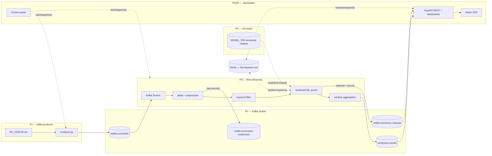

# Reddit Sentiment Pipeline — Big Data Project

A real-time big-data pipeline that replays a historical Reddit comment dump
through Kafka, cleans and tokenizes it with Apache Flink, scores sentiment
with a self-trained ML model, and visualizes per-keyword sentiment trends
live in a web dashboard.

Built as a university Big Data course project, split into six phases (P1–P6),
each owned by its own folder in this repo:

| Phase | Component               | Folder             | Role |
|-------|--------------------------|---------------------|------|
| P1    | Data replay / producer   | [`kafka-producer/`](kafka-producer/) | Reads the Reddit dump and replays it into Kafka in timestamp order |
| P2    | Message broker           | `kafka-producer/docker/` | 3-broker Kafka cluster (KRaft, no Zookeeper) |
| P3    | Stream processing        | [`flink-streaming/`](flink-streaming/) | Cleans, tokenizes, tags keywords, scores sentiment, aggregates windows |
| P4    | ML model                 | [`ml-model/`](ml-model/) | Trains and versions the sentiment classifier used by Flink |
| P5    | Dashboard (serving/UI)   | [`dashboard/`](dashboard/) | REST + WebSocket API and React SPA showing live sentiment |
| P6    | Ops / deployment         | `dashboard/` (control panel) | Docker packaging and a UI control panel to drive the whole pipeline |

Each folder has its own detailed README; this document explains how the
pieces fit together and how to stand the whole pipeline up end to end.

---

## Architecture



**Data flow, in words:**

1. **kafka-producer** streams historical comments from a `.zst`-compressed
   Reddit dump into the `reddit-comments` Kafka topic, in strict
   `created_utc` order, at a configurable replay speed.
2. **Kafka** (3 brokers, KRaft mode) is the backbone connecting every other
   component. Topics: `reddit-comments` → `reddit-comments-cleaned` /
   `reddit-comments-malformed` → `sentiment-results`.
3. **flink-streaming** consumes raw comments, strips URLs/markdown,
   tokenizes (emoji-safe), detects language, tags each comment with any
   matched keywords, scores sentiment using the trained model from
   **ml-model**, and aggregates results into per-keyword tumbling
   event-time windows.
4. **ml-model** is trained offline (VADER lexicon labels a corpus, then a
   real classifier — TF-IDF/Word2Vec features + scikit-learn — is trained
   on those labels). The versioned model store is mounted into the Flink
   containers; the scorer hot-reloads new versions without a restart.
5. **dashboard** consumes `sentiment-results` (aggregated windows) and
   `reddit-comments-cleaned` (individual comments) and serves both a REST/
   WebSocket API and a React SPA with live charts, a comment feed, and
   Kafka/Flink health monitoring tabs.
6. **Redis** holds the live, shared set of tracked keywords (used by both
   the Flink job and the dashboard) so keywords can be added/removed at
   runtime without restarting the pipeline.

All Docker services join a single external network, **`bd_streaming`**,
so containers can address each other by service name (`kafka-1`,
`jobmanager`, `redis`, …) regardless of which folder's compose file started
them.

---

## Repository layout

```
.
├── kafka-producer/     # P1 — dataset replay into Kafka + local Kafka cluster (docker/)
├── flink-streaming/    # P3 — PyFlink job: parse, preprocess, keyword-tag, score, window
├── ml-model/           # P4 — training pipeline + versioned model store
├── dashboard/          # P5/P6 — FastAPI + React serving layer and control panel
├── RC_2019-04.zst      # Reddit comment dump (not committed — see Dataset below)
└── README.md           # this file
```

Each subfolder README documents its internals in depth:

- [`kafka-producer/README.md`](kafka-producer/README.md)
- [`flink-streaming/README.md`](flink-streaming/README.md)
- [`ml-model/README.md`](ml-model/README.md)
- [`dashboard/README.md`](dashboard/README.md)

---

## Requirements

- **Docker Desktop** (with enough memory allocated — Kafka + Flink + Redis +
  dashboard together are comfortably run with 4+ GB free)
- **Python 3.11** (all Python components target 3.11)
- **Node.js 18+** and npm (only needed for local dashboard frontend dev —
  Docker builds the SPA itself)
- The dataset file **`RC_2019-04.zst`** (a Pushshift-style Reddit comments
  dump for April 2019) placed at the **repo root**. It is large (tens of GB)
  and is git-ignored; ask your team for the shared copy or dataset source.
- Free host ports: `9092`, `9095`, `9096` (Kafka), `8081` (Flink UI),
  `6379` (Redis), `8000` (dashboard API), `5173` (Vite dev server, optional)

---

## Quick start — full pipeline with Docker

Services must be started **in order** because each later compose file joins
the `bd_streaming` network created by an earlier one.

### 1. Start Kafka (creates the shared network)

```bash
cd kafka-producer
docker compose -f docker/docker-compose.yml up -d
```

Confirm the cluster is healthy:

```bash
docker exec kafka-1 /opt/kafka/bin/kafka-topics.sh --bootstrap-server localhost:9092 --list
```

### 2. Train an ML model (first time only)

The Flink job will run without a model (scoring is skipped with
`sentiment_status: no_model_available`), but for real sentiment output you
need a trained model before or shortly after starting Flink:

```bash
cd ml-model
python -m venv .venv && source .venv/bin/activate   # Windows: .venv\Scripts\activate
pip install -r requirements.txt
cp .env.example .env

# 1. Label a corpus of cleaned comments with VADER (labels only)
python src/ml_model/labeling/label_corpus.py --input data/cleaned_comments.jsonl --output data/labeled_comments.jsonl

# 2. Train the real classifier
python src/ml_model/model/train.py --input data/labeled_comments.jsonl --feature tfidf
```

This writes a new version under `ml-model/models/`. Flink mounts this
directory directly, so the running scorer hot-reloads it automatically.

### 3. Start Flink (builds the ML model into its image and joins Kafka)

```bash
cd flink-streaming
cp .env.example .env
docker compose -f docker/docker-compose.yml up -d --build
```

Check the job submitted:

```bash
docker logs flink-reddit-job
```

Look for `Job has been submitted with JobID ...`, or open the Flink Web UI
at **http://localhost:8081** → Running Jobs.

### 4. Start the dashboard

```bash
cd dashboard
docker compose -f docker/docker-compose.yml up --build
```

Open **http://localhost:8000**. The dashboard's **Pipeline** tab shows an
end-to-end health board (Producer → Kafka → Flink → ML → Dashboard), and
its **control panel** can start/stop the producer and reset the pipeline
directly from the UI (local development only — gated behind
`CONTROL_ENABLED`).

### 5. Replay data into the pipeline

Either use the dashboard's control panel, or run the producer manually:

```bash
cd kafka-producer
python data/make_test_data.py                                    # small smoke-test dataset
python src/producer/producer.py \
  --file data/test_data.zst \
  --broker localhost:9092,localhost:9095,localhost:9096 \
  --speed 100
```

For the full historical dataset, point `--file` at `RC_2019-04.zst` (or set
`ZST_FILE` in `.env`) and pick a `--speed` multiplier appropriate for how
fast you want the 2019-04-01 → 2019-04-17 window replayed.

Watch sentiment appear live in the dashboard's **Sentiment** tab (per-window
aggregates need a full window to close — lower `WINDOW_SIZE_SEC` for faster
feedback during testing).

### Teardown

```bash
cd dashboard        && docker compose -f docker/docker-compose.yml down
cd ../flink-streaming && docker compose -f docker/docker-compose.yml down
cd ../kafka-producer  && docker compose -f docker/docker-compose.yml down
```

> Do **not** add `--remove-orphans` here — the compose files share the
> `bd_streaming` project/network, and `--remove-orphans` will tear down
> containers from the *other* compose files too.

---

## Local development (without Docker)

Each component can run natively against Docker-hosted Kafka/Flink/Redis —
useful for fast iteration on one piece at a time. See each subfolder's
README for details:

- **kafka-producer** — `pytest tests/ -v`, then run `producer.py` directly
  against `localhost:9092,localhost:9095,localhost:9096`.
- **flink-streaming** — `pytest tests/ -v` needs no Docker; running the job
  itself (`python src/flink_job/main.py`) needs a live Kafka + Flink
  cluster.
- **ml-model** — fully Docker-free; training and retraining are plain
  Python scripts over local `.jsonl` files.
- **dashboard** — `USE_MOCK_DATA=true uvicorn src.main:app --reload` runs
  the API against generated mock data (no Kafka/Flink needed), with
  `npm run dev` for the Vite frontend with hot reload.

---

## Configuration

Every component reads its config from environment variables, documented in
its own `.env.example`. The values that are **shared across components**
and must stay consistent:

| Variable | Purpose | Docker network value | Host value |
|----------|---------|----------------------|------------|
| `KAFKA_BROKER` | Kafka bootstrap servers | `kafka-1:9094,kafka-2:9094,kafka-3:9094` | `localhost:9092,localhost:9095,localhost:9096` |
| `REDIS_URL` | Shared live-keyword set | `redis://redis:6379/0` | `redis://localhost:6379/0` |
| `FLINK_API_URL` | Flink JobManager REST API | `http://jobmanager:8081` | `http://localhost:8081` |
| Topic names | `reddit-comments`, `reddit-comments-cleaned`, `reddit-comments-malformed`, `sentiment-results` | same across every component | same |

Copy each `.env.example` to `.env` in its folder and adjust as needed;
`.env` files are git-ignored.

---

## Testing

Every component ships its own unit tests, runnable without Docker:

```bash
cd kafka-producer  && pytest tests/ -v
cd flink-streaming && pytest tests/ -v
cd ml-model        && pytest tests/ -v
cd dashboard       && USE_MOCK_DATA=true pytest -v && cd frontend && npx vitest run
```

---

## Troubleshooting

| Issue | Fix |
|-------|-----|
| `network bd_streaming not found` | Start **kafka-producer**'s compose first — it creates the network |
| Flink job never becomes RUNNING / very slow on Windows or x86_64 | Make sure `platforms: linux/arm64` is **not** set anywhere in the Flink compose file — it forces emulation and cripples the pipeline on non-ARM hosts |
| Tearing down one service kills Kafka/Flink too | Don't pass `--remove-orphans` to `docker compose down` — the compose files intentionally share the `bd_streaming` project, and orphan-removal takes out sibling services |
| Dashboard frontend Docker build fails with `EBADPLATFORM` | `@tailwindcss/oxide-win32-x64-msvc` must live in `optionalDependencies` in `dashboard/frontend/package.json`, not `dependencies` — otherwise Linux-based Docker builds fail trying to install a Windows-only native binary |
| `http://localhost:8081` connection refused | `docker ps` — `flink-jobmanager` must be **Up**; check `docker logs flink-jobmanager` |
| No messages on `reddit-comments-cleaned` | Producer may have run before the Flink job was RUNNING; re-run it, or set `KAFKA_STARTING_OFFSET=earliest` |
| No messages on `sentiment-results` | Comments must match `KEYWORD_FILTER` **and** have a `sentiment_label`; windows are event-time — wait for the watermark or lower `WINDOW_SIZE_SEC` |
| `sentiment_status: no_model_available` | Train a model in `ml-model` (see Quick start step 2) — the scorer hot-reloads once a model appears under the mounted `MODEL_DIR` |

Full per-component troubleshooting tables live in each subfolder's README.
