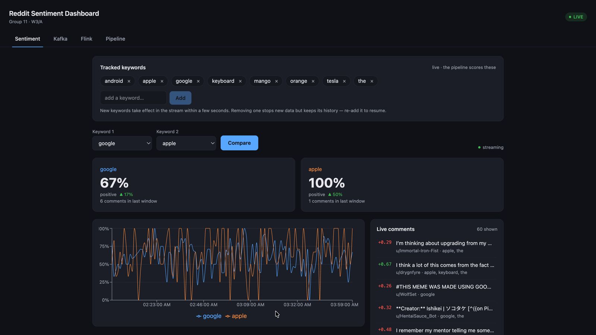
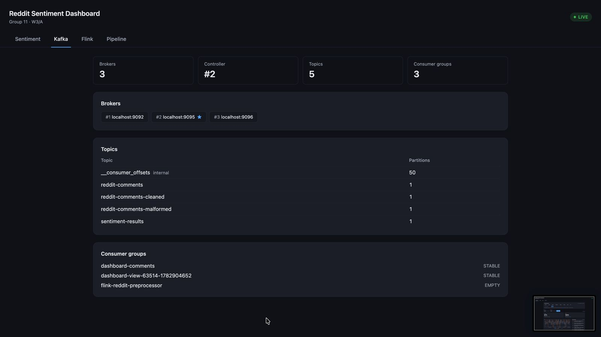
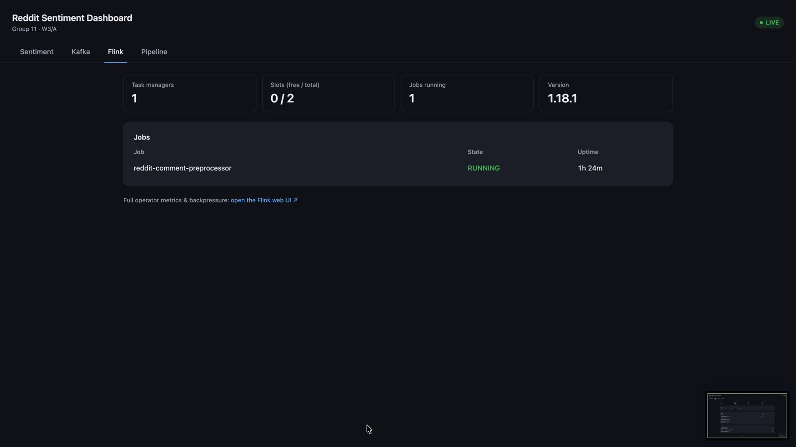
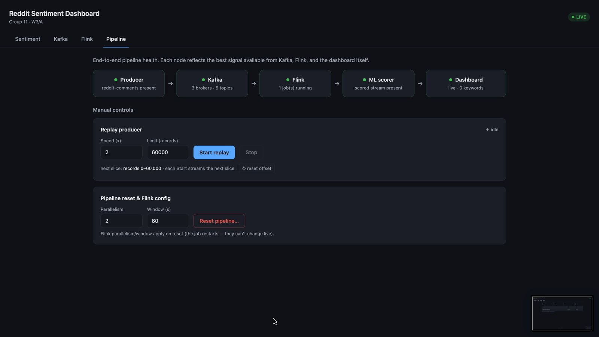
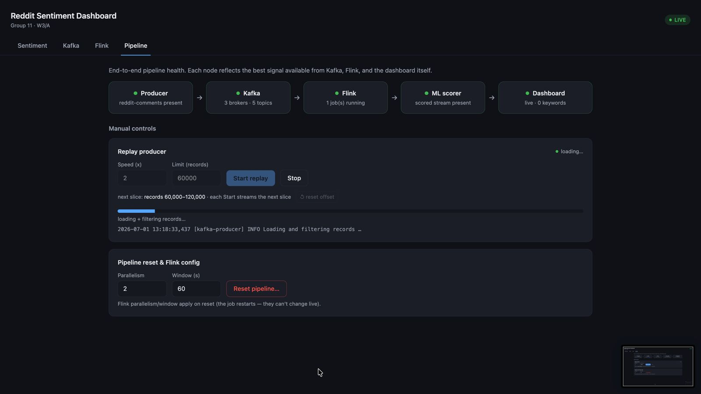

# Dashboard (P5 and P6) — Web GUI + REST/WebSocket API

The serving and UI layer of the sentiment-analysis pipeline. A React single-page
app (served by FastAPI) with four tabs:

- **Sentiment** — compare two keywords: live % positive, a streaming chart, and a
  live feed of individual scored comments.
- **Kafka** — brokers, topics, and consumer groups (via the Kafka AdminClient).
- **Flink** — running jobs, slots, and state (via the Flink JobManager REST API).
- **Pipeline** — operational flow diagram in four stages (ingestion → Flink processing
  → Kafka outputs → dashboard) with color-coded health status on each hop; includes
  manual replay/reset controls.

```
Reddit data (P1) → Kafka (P2) → Flink preprocessing (P3) → ML model (P4) → [ THIS: dashboard (P5) ] → cloud (P6)
```

Live updates arrive over a **WebSocket** (`/ws`); REST is used only for the
initial snapshot and the polling monitoring tabs. The dashboard consumes two
Kafka topics: **`sentiment-results`** (aggregated windows → chart) and
**`reddit-comments-cleaned`** (individual scored comments → live feed).

---

## Screenshots

**Sentiment** — compare two keywords live, with a streaming chart and comment feed:



**Kafka** — brokers, topics, and consumer groups:



**Flink** — running jobs, slots, and version info:



**Pipeline** — operational flow diagram with color-coded health status and manual replay/reset controls:





The Pipeline tab is laid out in four sections top-to-bottom:

1. **Ingestion** — `RC_2019-04.zst` → Producer → `reddit-comments`
2. **Stream processing** — Flink Job with side-inputs from `ml-model store` (hot-reload) and `Redis keywords` (tracked keywords)
3. **Kafka outputs** — `reddit-comments-malformed`, `reddit-comments-cleaned`, `sentiment-results`
4. **Dashboard** — DASH (FastAPI) consumes cleaned comments + window aggregates (+ keywords from Redis) → React UI

Green arrows mean data is flowing; amber means a stage is waiting; red marks a blocked step. An issue banner points to the first problem on the critical path.

---

## What's inside

```
dashboard/
├── docker/
│   ├── Dockerfile            # multi-stage: build SPA (node) → python runtime
│   └── docker-compose.yml    # joins the shared bd_streaming network
├── frontend/                 # React + Vite + Tailwind SPA
│   ├── src/
│   │   ├── App.jsx           # tab shell + LIVE/MOCK badge
│   │   ├── tabs/             # Sentiment / Trends / Kafka / Flink / Overview
│   │   ├── components/       # cards, chart, feed, panels
│   │   └── lib/              # useWebSocket, usePoll, api, message reducer
│   └── vite.config.js        # base=/static/, build → ../src/web, dev proxy
├── src/
│   ├── main.py               # FastAPI app: REST + /ws + serves the SPA
│   ├── consumer.py           # three Kafka consumers (+ mock mode) + broadcast sinks
│   ├── ws_hub.py             # thread→async bridge, subscription fan-out
│   ├── ratelimit.py          # per-keyword token bucket for the comment feed
│   ├── store.py              # in-memory window store, keyed by keyword
│   ├── analytics_store.py    # sketch analytics (trending + reach) for the Trends tab
│   ├── comment_store.py      # bounded recent-comment buffer, keyed by keyword
│   ├── kafka_admin.py        # Kafka introspection for the Kafka tab
│   ├── flink_proxy.py        # Flink REST proxy for the Flink tab
│   ├── web/                  # built SPA (generated; gitignored)
│   └── static/index.html     # fallback page when the SPA isn't built
└── tests/                    # pytest (backend) — frontend uses vitest
```

---

## Run locally (mock data, no Kafka/Flink needed)

Two processes in dev: uvicorn (API + WebSocket) and the Vite dev server (UI with
hot reload, proxying `/api` and `/ws` to uvicorn).

```bash
cd dashboard
python3.11 -m venv .venv && source .venv/bin/activate
pip install -r requirements.txt
USE_MOCK_DATA=true uvicorn src.main:app --reload      # terminal 1  (:8000)

cd frontend && npm install && npm run dev             # terminal 2  (:5173)
```

Open **http://localhost:5173**. The badge shows **MOCK**, the chart streams, and
the comment feed scrolls — all from generated data.

> Prefer a single port? Run `npm run build` (outputs to `src/web/`) and open the
> uvicorn server at **http://localhost:8000** — FastAPI serves the built SPA.

---

## Run against real Kafka + Flink

```bash
cp .env.example .env        # then edit values
cd frontend && npm run build && cd ..
USE_MOCK_DATA=false uvicorn src.main:app --host 0.0.0.0 --port 8000
```

Key env vars (see `.env.example`): `KAFKA_BROKER`, `KAFKA_TOPIC`,
`KAFKA_COMMENTS_TOPIC`, `KAFKA_ANALYTICS_TOPIC`, `FLINK_API_URL`.

---

## Run with Docker (joins the pipeline)

The image builds the SPA itself. Start order: Kafka → Flink → dashboard.

```bash
cd dashboard
docker compose -f docker/docker-compose.yml up --build
```

It joins the external `bd_streaming` network and reaches Kafka at
`kafka-1:9094,…` and Flink at `http://jobmanager:8081`.

---

## API

| Method | Endpoint | Purpose |
|--------|----------|---------|
| GET | `/` | the dashboard SPA |
| GET | `/health` | liveness + known keywords |
| GET | `/api/meta` | data mode (`live`/`mock`) + known keywords (drives the badge) |
| GET | `/api/compare?keyword1=&keyword2=` | window time series for two keywords |
| GET | `/api/timeseries?keyword=` | window time series for one keyword |
| GET | `/api/comments?keyword=&limit=` | recent scored comments (feed backfill) |
| GET | `/api/trending` | trending words + phrases around the *currently tracked* keywords, with window-over-window momentum (Count-Min Sketch, Trends tab) |
| GET | `/api/reach[?keyword=]` | approx. unique authors per keyword (HyperLogLog); with `keyword`, its history |
| GET | `/api/kafka/overview`,`/topics`,`/groups` | Kafka introspection |
| GET | `/api/flink/overview`,`/jobs`,`/jobs/{id}` | Flink JobManager proxy |
| WS  | `/ws` | live plane — send `{"subscribe":[...]}`, receive `window`/`comment` messages |

The monitoring endpoints degrade gracefully: if Kafka/Flink are unreachable they
return `{"available": false, "error": ...}` rather than failing.

---

## Tests

```bash
cd dashboard
USE_MOCK_DATA=true ./.venv/bin/python -m pytest          # backend
cd frontend && npx vitest run                            # frontend unit tests
```
