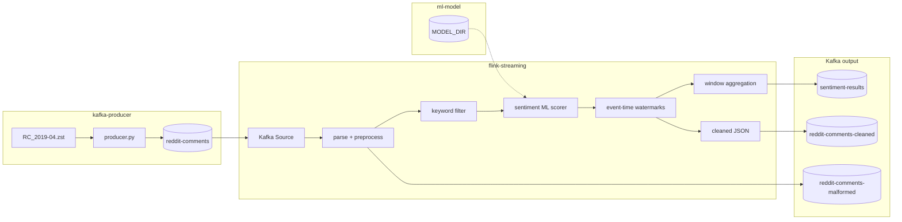

# Reddit Comment Flink Preprocessor

Apache Flink (PyFlink) streaming pipeline for the university big-data project.

**Reads** Reddit comments from Kafka (written by `../kafka-producer`) → **preprocesses** in real time (emoji-safe UTF-8) → **scores sentiment** with the trained ML model from `../ml-model` → **writes** cleaned comments and per-keyword window aggregates for the dashboard.

> **Out of scope for this folder:** Kafka producer code, offline model training (see `../ml-model`).

---

## How this fits the team project

| Step | Component | Topic | Folder |
|------|-----------|-------|--------|
| 1 | Kafka cluster (3 brokers) | - | `kafka-producer/docker/` |
| 2 | Producer script | `reddit-comments` | `kafka-producer/` |
| 3 | **This Flink job** | `reddit-comments` → `reddit-comments-cleaned` + `sentiment-results` | `flink-streaming/` |
| 4 | ML model (train + store) | model files at `MODEL_DIR` | `ml-model/` |
| 5 | Dashboard | consumes `sentiment-results` | `dashboard/` |

Docker is **split on purpose**:

- **Kafka** lives in `kafka-producer/docker/docker-compose.yml`
- **Flink** lives in `flink-streaming/docker/docker-compose.yml`
- Both join Docker network **`bd_streaming`** (created when you start Kafka)

See also: [`../README.md`](../README.md) for the full team runbook.

---

## Architecture



| Stage | What happens |
|-------|----------------|
| **Kafka Source** | Reads UTF-8 JSON strings from `reddit-comments` |
| **Parse** | Validates fields; bad records → `reddit-comments-malformed` |
| **Preprocess** | Removes URLs/markdown; drops non-English comments; tokenizes; keeps emojis |
| **Keyword filter** | Tags each record with `matched_keywords` (e.g. `apple`, `android`); ambiguous keywords like `apple` also get an entry in `keyword_senses` (e.g. `{"apple": "company"}`) via context-word disambiguation |
| **Sentiment ML** | Scores `tokens` via `SentimentMLFunction` / `ModelScorer` from `ml-model` |
| **Event time** | Watermarks from `created_utc` |
| **Window aggregation** | Per-keyword tumbling event-time windows → `sentiment-results` |
| **Kafka Sinks** | Cleaned comments → `reddit-comments-cleaned`; aggregates → `sentiment-results` |

Flink connects to Kafka using **JAR connectors** baked into `docker/Dockerfile`:

- `flink-connector-kafka-3.2.0-1.18.jar`
- `kafka-clients-3.7.0.jar`
- `flink-connector-base-1.18.1.jar`

### Cleaned comment (`reddit-comments-cleaned`)

Each scored, preprocessed comment written for downstream use or inspection:

```json
{
  "id": "abc123",
  "author": "some_user",
  "created_utc": 1554076812,
  "subreddit": "technology",
  "original_body": "Check this out 🔥 https://example.com",
  "cleaned_body": "Check this out 🔥",
  "tokens": ["Check", "this", "out", "🔥"],
  "score": 42,
  "controversiality": 0,
  "matched_keywords": ["apple"],
  "keyword_senses": {"apple": "company"},
  "sentiment_label": "positive",
  "sentiment_score": 0.87,
  "sentiment_model": "v20240620_120000",
  "sentiment_status": "scored"
}
```

`sentiment_status` may also be `skipped_too_short` or `no_model_available` when the model is missing or tokens are below `MIN_TOKENS`.

**Word-sense disambiguation**: `matched_keywords` is unchanged (always plain keyword strings, e.g. `apple`, `android`) so existing consumers keyed on exact keyword strings (window aggregation, dashboard subscriptions) keep working without modification. Keywords configured as ambiguous in `disambiguation.py` (currently `apple`) additionally get an entry in the new `keyword_senses` dict, mapping the matched keyword to its resolved sense: `"company"`, `"fruit"`, or `"ambiguous"` when context is inconclusive. Non-ambiguous keywords (e.g. `android`) never appear in `keyword_senses`. Consumers that don't care about sense can ignore the new field entirely.

### Dashboard aggregate (`sentiment-results`)

Per-keyword, per-window records consumed by `../dashboard`:

```json
{
  "keyword": "apple",
  "window_start": 1554076800,
  "window_end": 1554080400,
  "positive_ratio": 0.6667,
  "comment_count": 3
}
```

Windows are **tumbling event-time** buckets (default 3600 s) keyed by keyword. Only comments with a `sentiment_label` and at least one `matched_keywords` entry contribute to aggregation.

### Sketch analytics (`analytics-results`)

Probabilistic-sketch summaries consumed by the dashboard's **Trends** tab. Two record
shapes share the topic, discriminated by `type`:

```json
{
  "type": "trending",
  "keyword": "apple",
  "window_start": 1554076800,
  "window_end": 1554080400,
  "items": [{"token": "apple watch", "count": 5000}, {"token": "battery life", "count": 4100}],
  "sketch": {"kind": "count-min", "width": 2048, "depth": 4, "stream_total": 812345}
}
```

Trending is computed **per tracked keyword** (one sketch per `(keyword, window)`),
over single words *and* two-word phrases from the keyword's comments — so the
dashboard can follow the tracked-keyword set live and the list reads as real
topics ("battery life", "apple watch") rather than lone words.

```json
{
  "type": "reach",
  "keyword": "apple",
  "window_start": 1554076800,
  "window_end": 1554080400,
  "unique_authors": 1200000,
  "comment_count": 1450000,
  "sketch": {"kind": "hyperloglog", "precision": 12, "std_error": 0.0163}
}
```

**Why sketches?** Exact answers to "how often does each token appear?" and "how many
*distinct* authors mentioned apple?" need memory proportional to the stream
(a counter per token; a set of author IDs per keyword). The sketches answer both in
**fixed memory, one pass**, at the cost of a small bounded error:

- **Count-Min Sketch** (`trending`): a `depth × width` grid of counters; each row
  hashes a token to one column. Query = the minimum of the token's cells — collisions
  can only inflate a cell, so estimates **never undercount**. A small candidate list
  alongside the grid tracks the current heavy hitters so the top-K can be enumerated.
- **HyperLogLog** (`reach`): hashes each author and remembers, per register, the
  longest run of leading zero bits ever seen. Duplicate authors hash identically and
  never move a register, so it counts **distinct** authors — no author IDs stored.

Both sketches **merge** (grids add cell-wise; registers take the max), which is what
lets Flink run them as windowed `AggregateFunction`s: each parallel worker sketches
only its share of the stream and Flink merges the partial sketches per window.

Tunables (accuracy vs memory — defaults chosen for this project's scale):

| Env var | Default | Effect |
|---|---|---|
| `CMS_WIDTH` × `CMS_DEPTH` | 2048 × 4 | overcount ≤ `e/width` ≈ 0.13 % of the window's terms, w.p. ≈ 98 %; grid ≈ 64 KB per keyword, flat forever |
| `TRENDING_TOP_K` | 20 | terms listed per (keyword, window) |
| `TRENDING_MIN_TOKENS` | 30 | minimum terms a (keyword, window) needs before it is published |
| `HLL_PRECISION` | 12 | 2¹² = 4096 registers ≈ 4 KB per (keyword, window); std error 1.04/√m ≈ 1.6 % |
| `ANALYTICS_WINDOW_SEC` | `WINDOW_SIZE_SEC` | tumbling event-time window for both sketches |
| `KAFKA_ANALYTICS_TOPIC` | `analytics-results` | output topic |

For contrast: exactly counting 2 M distinct authors needs ~16 MB of IDs for **one**
keyword; the HLL does it in 4 KB within ~2 %.

---

## Folder structure and what each file does

```
flink-streaming/
├── README.md
├── requirements.txt
├── .env.example                 # Copy to .env for local overrides
├── config/
│   └── settings.py              # Reads env vars (topics, preprocessing flags)
├── docker/
│   ├── docker-compose.yml       # Flink ONLY (JobManager + TaskManager + job submit)
│   ├── Dockerfile               # Flink image + Kafka JARs + Python packages
│   └── conf/flink-conf.yaml     # Cluster memory, checkpoints, REST UI port 8081
├── src/flink_job/
│   ├── main.py                  # Entry: load config → build pipeline → execute job
│   ├── logging_setup.py         # Log format and level
│   ├── job/
│   │   └── reddit_stream_job.py # Wires full pipeline incl. ML scorer + results sink
│   ├── sources/
│   │   └── kafka_io.py          # KafkaSource / KafkaSink builders
│   ├── operators/
│   │   ├── parse.py             # JSON parse, validation, cleaning, side output
│   │   ├── keyword_filter.py    # Tags matched_keywords from KEYWORD_FILTER
│   │   ├── disambiguation.py    # Context-word sense resolution (apple: company vs fruit)
│   │   ├── sentiment_ml.py      # Real-time ML scoring (ModelScorer from ml-model)
│   │   ├── sentiment_window.py  # Keyword fan-out + tumbling window aggregation
│   │   ├── sketches.py          # Count-Min + HyperLogLog sketches -> analytics-results
│   │   └── sentiment_placeholder.py  # NullSentimentScorer interface (used by tests)
│   └── preprocessing/
│       ├── cleaner.py           # URL/markdown removal (emoji-safe)
│       ├── language_detector.py # English-only gate (drops non-English comments)
│       └── tokenizer.py         # Tokenization, optional stopwords/stem
├── scripts/
│   └── validate_output.py       # Read cleaned topic and check schema
├── tests/                       # Unit tests (no Docker required)
└── output/                      # Used if OUTPUT_SINK=file
```

---

## Run instructions (Docker-recommended)

### Prerequisites

- Docker Desktop running
- **Start Kafka before Flink** (Flink needs network `bd_streaming`)

### Step 1 - Start Kafka (teammate folder, required first)

```powershell
cd ..\kafka-producer
docker compose -f docker/docker-compose.yml up -d
```

Wait until healthy (~10 s). Optional check:

```powershell
docker exec kafka-1 /opt/kafka/bin/kafka-topics.sh --bootstrap-server localhost:9092 --list
```

### Step 2 - Start Flink (this folder)

```powershell
cd ..\flink-streaming
copy .env.example .env
docker compose -f docker/docker-compose.yml up -d --build
```

| Service | Container name | Purpose |
|---------|----------------|---------|
| JobManager | `flink-jobmanager` | Cluster + **Web UI http://localhost:8081** |
| TaskManager | `flink-taskmanager` | Runs operators |
| Job submitter | `flink-reddit-job` | Submits PyFlink job then exits (normal) |

**Check job submitted:**

```powershell
docker logs flink-reddit-job
```

Look for: `Job has been submitted with JobID ...`

**Check job running:** open http://localhost:8081 → **Running Jobs** → `reddit-comment-preprocessor`

### Step 3 - Send data (kafka-producer on host)

```powershell
cd ..\kafka-producer
pip install -r requirements.txt
python data/make_test_data.py
python src/producer/producer.py --file data/test_data.zst --broker localhost:9092,localhost:9095,localhost:9096 --speed 100
```

Expected: `Total records sent: 4`

> **Note:** If the Flink job started with `KAFKA_STARTING_OFFSET=latest` and you sent data *before* the job was running, run the producer again after the job is RUNNING, or set `KAFKA_STARTING_OFFSET=earliest` in compose and restart.

### Step 4 - See cleaned output

**Option A - Kafka console:**

```powershell
docker exec kafka-1 /opt/kafka/bin/kafka-console-consumer.sh --bootstrap-server localhost:9092 --topic reddit-comments-cleaned --from-beginning --max-messages 5
```

**Option B - Validation script:**

```powershell
cd ..\flink-streaming
pip install confluent-kafka
python scripts/validate_output.py --broker localhost:9092,localhost:9095,localhost:9096 --topic reddit-comments-cleaned
```

**What you should see:** ~4 messages (from `test_data.zst`), emojis in `original_body`, URLs removed in `cleaned_body`, `tokens` array present.

**Malformed topic (usually empty for test data):**

```powershell
docker exec kafka-1 /opt/kafka/bin/kafka-console-consumer.sh --bootstrap-server localhost:9092 --topic reddit-comments-malformed --from-beginning --max-messages 3
```

### Step 5 - See sentiment-results (dashboard input)

After event-time windows close (default 1 h windows; use test data with recent timestamps or lower `WINDOW_SIZE_SEC` for quicker results):

```powershell
docker exec kafka-1 /opt/kafka/bin/kafka-console-consumer.sh --bootstrap-server localhost:9092 --topic sentiment-results --from-beginning --max-messages 5
```

Records appear only when comments match a `KEYWORD_FILTER` term **and** receive a `sentiment_label` from the ML scorer.

---

## Restart / rebuild Flink only

```powershell
cd flink-streaming
docker compose -f docker/docker-compose.yml down
docker compose -f docker/docker-compose.yml up -d --build
```

If container name conflicts:

```powershell
docker rm -f flink-jobmanager flink-taskmanager flink-reddit-job
docker compose -f docker/docker-compose.yml up -d --build
```

---

## Local development (no Docker submitter)

```powershell
python -m venv .venv
.venv\Scripts\activate
pip install -r requirements.txt
copy .env.example .env
pytest tests/ -v
```

Requires Kafka + Flink cluster already running; then:

```powershell
python src/flink_job/main.py
```

---

## Configuration

| Variable | Default (Docker) | Description |
|----------|------------------|-------------|
| `KAFKA_BROKER` | `kafka-1:9094,kafka-2:9094,kafka-3:9094` in compose | Host scripts: `localhost:9092,localhost:9095,localhost:9096` |
| `KAFKA_INPUT_TOPIC` | `reddit-comments` | Must match producer topic |
| `KAFKA_OUTPUT_TOPIC` | `reddit-comments-cleaned` | Preprocessed + scored comments |
| `KAFKA_RESULTS_TOPIC` | `sentiment-results` | Per-keyword window aggregates for dashboard |
| `KAFKA_MALFORMED_TOPIC` | `reddit-comments-malformed` | Parse failures |
| `KEYWORD_FILTER` | `apple,android` in compose | Comma-separated keywords to track |
| `WINDOW_SIZE_SEC` | `3600` | Tumbling event-time window size (seconds) |
| `MODEL_DIR` | `/models` in Docker image | Trained model store (mount or bake in) |
| `MIN_TOKENS` | `2` | Skip scoring when fewer tokens |
| `KAFKA_STARTING_OFFSET` | `earliest` in compose | `earliest` or `latest` |
| `FLINK_PARALLELISM` | `2` | Operator parallelism |
| `FLINK_CHECKPOINT_INTERVAL_MS` | `60000` | Checkpoint interval |
| `WATERMARK_MAX_OUT_OF_ORDER_SEC` | `5` | Event-time lateness |
| `PREPROCESS_REMOVE_URLS` | `1` | Strip URLs |
| `PREPROCESS_REMOVE_MARKDOWN` | `1` | Strip Reddit markdown |
| `PREPROCESS_LOWERCASE` | `0` | Off by default |
| `PREPROCESS_REMOVE_STOPWORDS` | `0` | Optional |
| `PREPROCESS_STEM` | `0` | Optional |
| `OUTPUT_SINK` | `kafka` | `kafka` or `file` |
| `LOG_LEVEL` | `INFO` | Logging |

---

## ML scorer and sentiment-results sink

The Flink image bundles `ml_model` from `../ml-model` (see `docker/Dockerfile`). At runtime:

1. **`SentimentMLFunction`** (`operators/sentiment_ml.py`) loads `ModelScorer` from `MODEL_DIR`.
2. Each comment's `tokens` are classified; four fields are added: `sentiment_label`, `sentiment_score`, `sentiment_model`, `sentiment_status`.
3. If no model exists yet, records still flow through with `sentiment_status: no_model_available` — the scorer hot-reloads when a model appears.
4. **`KeywordFanoutFunction`** + **`SentimentWindowFunction`** aggregate scored comments per keyword over tumbling event-time windows.
5. Results are written to **`sentiment-results`** via `kafka-sentiment-results-sink`.

To train a model before running the full pipeline, see `../ml-model/README.md`. Mount trained weights into the Flink container at `MODEL_DIR` (default `/models`) when rebuilding or via a compose volume.

The placeholder module (`sentiment_placeholder.py`) remains as the `SentimentScorer` interface and for unit tests without a loaded model.

---

## Teardown

```powershell
docker compose -f docker/docker-compose.yml down
cd ..\kafka-producer
docker compose -f docker/docker-compose.yml down
```

---

## Troubleshooting

| Issue | Fix |
|-------|-----|
| http://localhost:8081 refused | `docker ps` - `flink-jobmanager` must be **Up**; check `docker logs flink-jobmanager` |
| `network bd_streaming not found` | Start **kafka-producer** compose first |
| `flink-reddit-job` shows `-m: command not found` | Rebuild: fixed in current `docker-compose.yml` (single-line command) |
| `No module named flink_job` | Rebuild image (`PYTHONPATH` fix in Dockerfile) |
| No messages on cleaned topic | Producer ran before job? Re-run producer; check Flink UI for FAILED job |
| No messages on `sentiment-results` | Comments must match `KEYWORD_FILTER` and have `sentiment_label`; windows are event-time — wait for watermark or lower `WINDOW_SIZE_SEC` |
| `sentiment_status: no_model_available` | Train model in `ml-model` and mount/copy to `MODEL_DIR`; scorer picks it up on hot-reload |
| Flink cannot reach Kafka | Flink must use `kafka-1:9094,kafka-2:9094,kafka-3:9094`, not `localhost:9092` |
| Container name already in use | `docker rm -f flink-jobmanager flink-taskmanager flink-reddit-job` then `up` again |
| Emojis broken | Should not happen; JSON uses `ensure_ascii=False` |
