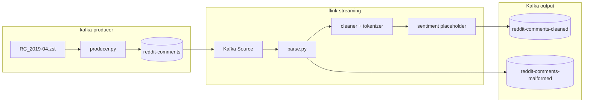

# Reddit Comment Flink Preprocessor

Apache Flink (PyFlink) streaming pipeline for the university big-data project.

**Reads** Reddit comments from Kafka (written by `../kafka-producer`) → **preprocesses** in real time (emoji-safe UTF-8) → **writes** cleaned records for future sentiment-model training.

> **Out of scope for this folder:** Kafka producer code, training the final sentiment model.

---

## How this fits the team project

| Step | Component | Topic | Folder |
|------|-----------|-------|--------|
| 1 | Kafka broker | - | `kafka-producer/docker/` |
| 2 | Producer script | `reddit-comments` | `kafka-producer/` |
| 3 | **This Flink job** | `reddit-comments` → `reddit-comments-cleaned` | `flink-streaming/` |
| 4 | Future ML | `reddit-comments-cleaned` | (another teammate) |

Docker is **split on purpose**:

- **Kafka** lives in `kafka-producer/docker/docker-compose.yml`
- **Flink** lives in `flink-streaming/docker/docker-compose.yml`
- Both join Docker network **`bd_streaming`** (created when you start Kafka)

See also: [`../README.md`](../README.md) for the full team runbook.

---

## Architecture



| Stage | What happens |
|-------|----------------|
| **Kafka Source** | Reads UTF-8 JSON strings from `reddit-comments` |
| **Parse** | Validates fields; bad records → `reddit-comments-malformed` |
| **Preprocess** | Removes URLs/markdown; tokenizes; keeps emojis |
| **Sentiment placeholder** | Adds `sentiment_*` fields (no real model yet) |
| **Event time** | Watermarks from `created_utc` |
| **Kafka Sink** | Writes JSON to `reddit-comments-cleaned` |

Flink connects to Kafka using **JAR connectors** baked into `docker/Dockerfile`:

- `flink-connector-kafka-3.2.0-1.18.jar`
- `kafka-clients-3.7.0.jar`
- `flink-connector-base-1.18.1.jar`

### Output record (what downstream ML should consume)

```json
{
  "id": "abc123",
  "created_utc": 1554076812,
  "subreddit": "technology",
  "original_body": "Check this out 🔥 https://example.com",
  "cleaned_body": "Check this out 🔥",
  "tokens": ["Check", "this", "out", "🔥"],
  "score": 42,
  "controversiality": 0,
  "sentiment_label": null,
  "sentiment_score": null,
  "sentiment_model": null,
  "sentiment_status": "pending_ml_integration"
}
```

---

## Folder structure and what each file does

```
flink-streaming/
├── README.md
├── requirements.txt
├── .env.example                 # Copy to .env for local overrides
├── config/
│   └── settings.py              # Reads env vars (topics, preprocessing flags)
├── docker/
│   ├── docker-compose.yml       # Flink ONLY (JobManager + TaskManager + job submit)
│   ├── Dockerfile               # Flink image + Kafka JARs + Python packages
│   └── conf/flink-conf.yaml     # Cluster memory, checkpoints, REST UI port 8081
├── src/flink_job/
│   ├── main.py                  # Entry: load config → build pipeline → execute job
│   ├── logging_setup.py         # Log format and level
│   ├── job/
│   │   └── reddit_stream_job.py # Wires operators: source → parse → sentiment → sink
│   ├── sources/
│   │   └── kafka_io.py          # KafkaSource / KafkaSink builders
│   ├── operators/
│   │   ├── parse.py             # JSON parse, validation, cleaning, side output
│   │   └── sentiment_placeholder.py  # Hook for future ML model
│   └── preprocessing/
│       ├── cleaner.py           # URL/markdown removal (emoji-safe)
│       └── tokenizer.py         # Tokenization, optional stopwords/stem
├── scripts/
│   └── validate_output.py       # Read cleaned topic and check schema
├── tests/                       # Unit tests (no Docker required)
└── output/                      # Used if OUTPUT_SINK=file
```

---

## Run instructions (Docker - recommended)

### Prerequisites

- Docker Desktop running
- **Start Kafka before Flink** (Flink needs network `bd_streaming`)

### Step 1 - Start Kafka (teammate folder, required first)

```powershell
cd ..\kafka-producer
docker compose -f docker/docker-compose.yml up -d
```

Wait until healthy (~10 s). Optional check:

```powershell
docker exec kafka /opt/kafka/bin/kafka-topics.sh --bootstrap-server localhost:9092 --list
```

### Step 2 - Start Flink (this folder)

```powershell
cd ..\flink-streaming
copy .env.example .env
docker compose -f docker/docker-compose.yml up -d --build
```

| Service | Container name | Purpose |
|---------|----------------|---------|
| JobManager | `flink-jobmanager` | Cluster + **Web UI http://localhost:8081** |
| TaskManager | `flink-taskmanager` | Runs operators |
| Job submitter | `flink-reddit-job` | Submits PyFlink job then exits (normal) |

**Check job submitted:**

```powershell
docker logs flink-reddit-job
```

Look for: `Job has been submitted with JobID ...`

**Check job running:** open http://localhost:8081 → **Running Jobs** → `reddit-comment-preprocessor`

### Step 3 - Send data (kafka-producer on host)

```powershell
cd ..\kafka-producer
pip install -r requirements.txt
python data/make_test_data.py
python src/producer/producer.py --file data/test_data.zst --broker localhost:9092 --speed 100
```

Expected: `Total records sent: 4`

> **Note:** If the Flink job started with `KAFKA_STARTING_OFFSET=latest` and you sent data *before* the job was running, run the producer again after the job is RUNNING, or set `KAFKA_STARTING_OFFSET=earliest` in compose and restart.

### Step 4 - See cleaned output

**Option A - Kafka console:**

```powershell
docker exec kafka /opt/kafka/bin/kafka-console-consumer.sh --bootstrap-server localhost:9092 --topic reddit-comments-cleaned --from-beginning --max-messages 5
```

**Option B - Validation script:**

```powershell
cd ..\flink-streaming
pip install confluent-kafka
python scripts/validate_output.py --broker localhost:9092 --topic reddit-comments-cleaned
```

**What you should see:** ~4 messages (from `test_data.zst`), emojis in `original_body`, URLs removed in `cleaned_body`, `tokens` array present.

**Malformed topic (usually empty for test data):**

```powershell
docker exec kafka /opt/kafka/bin/kafka-console-consumer.sh --bootstrap-server localhost:9092 --topic reddit-comments-malformed --from-beginning --max-messages 3
```

---

## Restart / rebuild Flink only

```powershell
cd flink-streaming
docker compose -f docker/docker-compose.yml down
docker compose -f docker/docker-compose.yml up -d --build
```

If container name conflicts:

```powershell
docker rm -f flink-jobmanager flink-taskmanager flink-reddit-job
docker compose -f docker/docker-compose.yml up -d --build
```

---

## Local development (no Docker submitter)

```powershell
python -m venv .venv
.venv\Scripts\activate
pip install -r requirements.txt
copy .env.example .env
pytest tests/ -v
```

Requires Kafka + Flink cluster already running; then:

```powershell
python src/flink_job/main.py
```

---

## Configuration

| Variable | Default (Docker) | Description |
|----------|------------------|-------------|
| `KAFKA_BROKER` | `kafka:9094` in compose | Use `localhost:9092` only for host scripts |
| `KAFKA_INPUT_TOPIC` | `reddit-comments` | Must match producer topic |
| `KAFKA_OUTPUT_TOPIC` | `reddit-comments-cleaned` | Preprocessed output |
| `KAFKA_MALFORMED_TOPIC` | `reddit-comments-malformed` | Parse failures |
| `KAFKA_STARTING_OFFSET` | `earliest` in compose | `earliest` or `latest` |
| `FLINK_PARALLELISM` | `2` | Operator parallelism |
| `FLINK_CHECKPOINT_INTERVAL_MS` | `60000` | Checkpoint interval |
| `WATERMARK_MAX_OUT_OF_ORDER_SEC` | `5` | Event-time lateness |
| `PREPROCESS_REMOVE_URLS` | `1` | Strip URLs |
| `PREPROCESS_REMOVE_MARKDOWN` | `1` | Strip Reddit markdown |
| `PREPROCESS_LOWERCASE` | `0` | Off by default |
| `PREPROCESS_REMOVE_STOPWORDS` | `0` | Optional |
| `PREPROCESS_STEM` | `0` | Optional |
| `OUTPUT_SINK` | `kafka` | `kafka` or `file` |
| `LOG_LEVEL` | `INFO` | Logging |

---

## Future sentiment ML integration

Edit `src/flink_job/operators/sentiment_placeholder.py`:

- Replace `NullSentimentScorer` with your model class
- Implement `score(cleaned_body, tokens) -> dict`
- Load model in `open()` if needed

---

## Teardown

```powershell
docker compose -f docker/docker-compose.yml down
cd ..\kafka-producer
docker compose -f docker/docker-compose.yml down
```

---

## Troubleshooting

| Issue | Fix |
|-------|-----|
| http://localhost:8081 refused | `docker ps` - `flink-jobmanager` must be **Up**; check `docker logs flink-jobmanager` |
| `network bd_streaming not found` | Start **kafka-producer** compose first |
| `flink-reddit-job` shows `-m: command not found` | Rebuild: fixed in current `docker-compose.yml` (single-line command) |
| `No module named flink_job` | Rebuild image (`PYTHONPATH` fix in Dockerfile) |
| No messages on cleaned topic | Producer ran before job? Re-run producer; check Flink UI for FAILED job |
| Flink cannot reach Kafka | Flink must use `kafka:9094`, not `localhost:9092` |
| Container name already in use | `docker rm -f flink-jobmanager flink-taskmanager flink-reddit-job` then `up` again |
| Emojis broken | Should not happen; JSON uses `ensure_ascii=False` |
